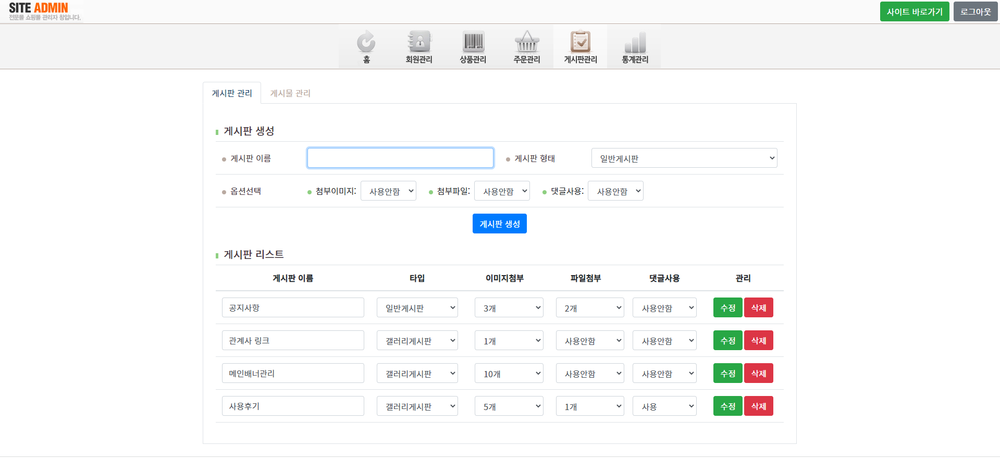
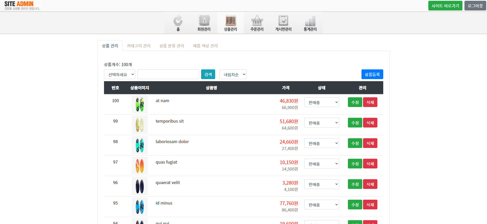
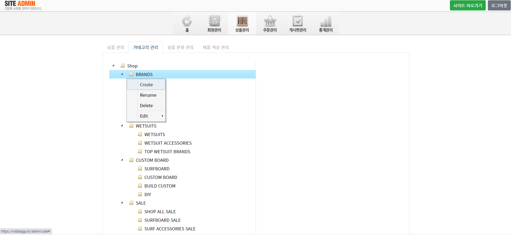
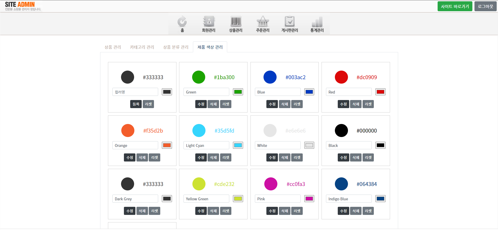

# [Node 쇼핑몰 관리자페이지(BACK)](https://www.nobbaggu.kr/admin)

# 1. 프로젝트 개요

## - 교육 과정 프로젝트 : 참여율 100%

## - 해당 Node 프로젝트 자체 이해도 60%

## - Node에 대한 생각

- node는 첫 프로젝트 이후 매우 중요하게 본인에게 필요한 기능의 언어라 판단
- 평일 주5일 09시~18시까지 JS개발자 과정을 들었고 추가로 일요일 Node수업에 참여함
- 평일 수업에서 배운 CRUD구현에 대한 과정을 동일하게 복습할 수 있는 시간
- Node로 Front, Back구분 없이 어느정도까지는 생각하는 아이템의 창업화가 가능하다고 확신함!

---

# 2. 프로젝트 방향

## - 5개월 교육과정 중 마지막 프로젝트 : 1개월 소요

## - JS개발자 과정 마지막 프로젝트

## - react로 front, node로 back 제작으로 전체 쇼핑몰 사이트 완성

---

# 3. 사실적 의견

## - 단순 sql 작성보다 sequelize 사용의 강력한 직접 느낌, CRUD구현 가능

## - jstree 적용 부분에 있어 depth3까지 들어간 후 이해x (데이터흐름)

- 그래서 '관계형데이터베이스'에 대한 학습과 이해가 반드시 꼭 필요함!!!!

---

# 4. 고도화 방향

## - 회원인증, sns로그인, PG결제 시스템 추가 적용까지 고도화 준비 연습

## - 구글 에널리틱스, 애드센스 적용으로 실제 수익가능성 확인도 시도하면 좋을듯함

---

# 5. 프로젝트 기획

## - 일반적인 쇼핑몰 관리자(admin) 형태로 제작

## - database(sequelize) 적용

## - seeders(더미데이터) 활용 user, product, cate, board 데이터 생성

## - node 서버 API로 Front에서 데이터 받아서 처리(GET)

---

# 6. 프로젝트 결과

## 

## 

## 

## 

## 

---

## 7. Dependencies

- pm2
- axios
- ejs
- multer
- color-convert
- nodemailer
- sharp
- jstree

---

## 8. Server

## - AWS EC2 / mySQL(sequelize)

---

## 9. 생각

## - 무조건 React를 하고 Node까지 가능한 프론트앤드 개발자!

## - node가 Back이 될 수도 있지만, Front에서 다룰 수 있는 방향으로의 이해 필요

## - 스타트업 운영에 있어 심플하게 MVP 돌려보기에는 React+Node(AWS)가 최적의 조합

## - JavaScript 학습이 더욱 필요하고 실무 능력뿐만 아니라 개념적인 부분에 대한 공부가 반드시 필요!

## - 늦었지만 제대로 할 수 있는 프론트앤드 개발자가 될 것이다! 화이팅 : )
